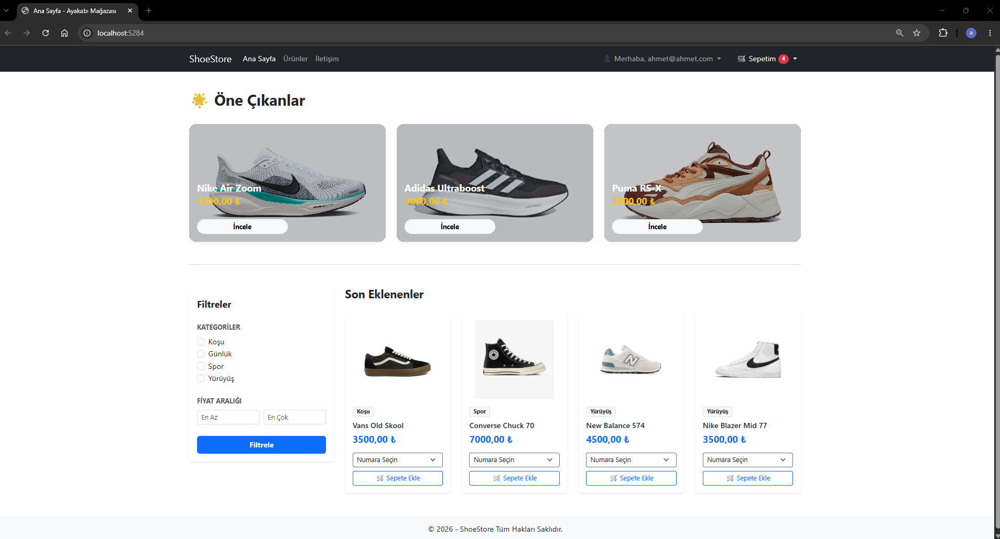
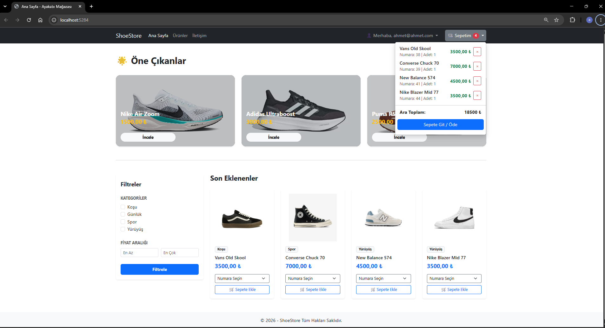

# 👟 ShoeStore1

**ShoeStore1**, ASP.NET Core MVC kullanılarak geliştirilmiş, katmanlı mimariye sahip bir **e-ticaret ayakkabı mağazası web uygulamasıdır**.

Proje; kullanıcı yönetimi, ürün listeleme, kategori ve ürün filtreleme, ürün detayları ve sepet işlemleri gibi temel e-ticaret fonksiyonlarını içermektedir.

Projenin geliştirilmesindeki temel amaç; **ASP.NET Core MVC, Entity Framework Core, SQL Server, REST API, katmanlı mimari ve yazılım tasarım prensipleri** konularında uygulamalı deneyim kazanmaktır.

---

## 🚀 Proje Özellikleri

* 👤 Kullanıcı kayıt ve giriş işlemleri
* 🔐 ASP.NET Core Identity ile kullanıcı yönetimi
* 🛍️ Ürün listeleme
* 🔎 Ürün filtreleme
* 🏷️ Kategori bazlı filtreleme
* 💰 Fiyat aralığına göre filtreleme
* 👟 Ürün beden seçenekleri
* 🛒 Sepete ürün ekleme
* ➕ Sepette ürün miktarı yönetimi
* 🗑️ Sepetten ürün silme
* ♻️ Soft Delete yapısı
* 🔌 REST API kullanımı
* ⚡ AJAX ile dinamik işlemler
* 🧩 Katmanlı mimari
* 📦 Generic Repository yapısı
* 🔄 Unit of Work yaklaşımı
* 🗃️ Entity Framework Core
* 🛢️ SQL Server veritabanı

---

## 🛠️ Kullanılan Teknolojiler

### Backend

* C#
* ASP.NET Core MVC
* Entity Framework Core
* ASP.NET Core Identity
* RESTful API
* LINQ
* Dependency Injection

### Frontend

* HTML5
* CSS3
* JavaScript
* jQuery
* AJAX
* Razor Views

### Database

* Microsoft SQL Server
* Entity Framework Core Migrations

### Architecture & Design

* Layered Architecture
* Generic Repository Pattern
* Unit of Work Pattern
* DTO
* ViewModel
* Dependency Injection
* Soft Delete

---

## 🏗️ Proje Mimarisi

Proje 4 ana katmandan oluşmaktadır:

```text
ShoeStore1
│
├── ShoeStore1.Core
│
├── ShoeStore1.Data
│
├── ShoeStore1.Service
│
└── ShoeStore1.Web
```

### 📁 ShoeStore1.Core

Uygulamanın temel katmanıdır.

Bu katmanda:

* Entity sınıfları
* Repository interface'leri
* Unit of Work interface'i
* BaseEntity
* Temel domain modelleri

bulunmaktadır.

Örneğin:

```text
BaseEntity
├── Id
├── CreateDate
├── UpdateDate
└── IsDeleted
```

`BaseEntity` üzerinden tüm entity'lerde ortak alanlar yönetilmektedir.

---

### 📁 ShoeStore1.Data

Veritabanı işlemlerinden sorumlu katmandır.

Bu katmanda:

* Entity Framework Core
* DbContext
* Repository implementasyonları
* Unit of Work implementasyonu
* Identity
* Database Migrations

bulunmaktadır.

Örneğin:

```text
GenericRepository<T>
UnitOfWork
DbContext
AppUser
AppRole
```

---

### 📁 ShoeStore1.Service

Uygulamanın iş mantığının bulunduğu katmandır.

Bu katmanda:

* Service sınıfları
* DTO'lar
* İş kuralları
* Entity → DTO dönüşümleri
* CRUD işlemlerinin yönetimi

gerçekleştirilmektedir.

Örneğin:

```text
ProductService
CartService
CartItemService
GenericService<T>
```

---

### 📁 ShoeStore1.Web

Uygulamanın kullanıcıyla etkileşime giren katmanıdır.

Bu katmanda:

* MVC Controllers
* API Controllers
* Views
* ViewModels
* JavaScript
* AJAX işlemleri
* Web tarafındaki servisler

bulunmaktadır.

---

## 🛒 Sepet Sistemi

Projede kullanıcı bazlı sepet yapısı bulunmaktadır.

Temel yapı:

```text
User
  │
  ▼
Cart
  │
  ├── CartItem
  │      ├── Product
  │      └── ProductSize
  │
  └── CartItem
```

Kullanıcı bir ürünü belirli bir beden ile sepete ekleyebilmektedir.

Sepet işlemleri AJAX üzerinden API'lere gönderilerek sayfanın tamamının yenilenmesine gerek kalmadan gerçekleştirilmektedir.

---

## ♻️ Soft Delete

Projede fiziksel silme yerine **Soft Delete** yaklaşımı kullanılmaktadır.

Bir kayıt doğrudan veritabanından silinmek yerine:

```csharp
entity.IsDeleted = true;
```

şeklinde işaretlenmektedir.

Böylece kayıt veritabanında korunurken uygulama içerisinde aktif kayıtlar:

```csharp
!x.IsDeleted
```

koşulu ile filtrelenmektedir.

Bu yaklaşım sayesinde geçmiş kayıtların tamamen kaybolmasının önüne geçilmektedir.

---

## 🔌 API Yapısı

Proje içerisinde AJAX işlemleri için API Controller'lar kullanılmaktadır.

Örneğin sepet işlemleri:

```text
/api/CartApi/GetUserCart
/api/CartApi/DeleteCartItem
```

gibi endpoint'ler üzerinden gerçekleştirilmektedir.

Frontend tarafında AJAX kullanılarak API'lere istek gönderilmektedir.

Örnek:

```javascript
$.ajax({
    url: '/api/CartApi/GetUserCart',
    type: 'GET',
    success: function (response) {
        // Sepet bilgilerini güncelle
    }
});
```

---

## 🔎 Ürün Filtreleme

Ürün filtreleme işlemleri API üzerinden gerçekleştirilmektedir.

Filtreleme kriterleri:

* Kategori
* Minimum fiyat
* Maksimum fiyat
* Ürün adı

gibi bilgiler kullanılarak ürün listesi dinamik olarak güncellenmektedir.

Frontend tarafında AJAX kullanıldığı için kullanıcı filtreleme yaptığında sayfanın tamamı yeniden yüklenmeden sonuçlar güncellenebilmektedir.

---

## 🗃️ Veritabanı

Proje **Microsoft SQL Server** ve **Entity Framework Core** kullanmaktadır.

Entity Framework Core sayesinde uygulama ile veritabanı arasındaki işlemler ORM yaklaşımı kullanılarak gerçekleştirilmektedir.

Migration yapısı kullanılarak veritabanı şeması yönetilmektedir.

---

## ⚙️ Kurulum

Projeyi kendi bilgisayarınızda çalıştırmak için:

### 1. Repository'yi klonlayın

```bash
git clone https://github.com/ahmetyilmaz-code/ShoeStore1.git
```

### 2. Projeyi Visual Studio ile açın

```text
ShoeStore1.slnx
```

dosyasını Visual Studio ile açın.

### 3. Veritabanı bağlantısını yapılandırın

`appsettings.json` içerisindeki connection string'i kendi SQL Server ortamınıza göre düzenleyin.

Örnek:

```json
{
  "ConnectionStrings": {
    "DefaultConnection": "Server=.;Database=ShoeStore1Db;Trusted_Connection=True;TrustServerCertificate=True"
  }
}
```

### 4. Migration'ları uygulayın

Package Manager Console üzerinden:

```powershell
Update-Database
```

komutunu çalıştırın.

### 5. Projeyi çalıştırın

Visual Studio üzerinden projeyi çalıştırabilirsiniz.

---

## 📂 Proje Yapısı

```text
ShoeStore1
│
├── ShoeStore1.Core
│   ├── Entities
│   └── Repositories
│
├── ShoeStore1.Data
│   ├── Identity
│   ├── Migrations
│   ├── Repositories
│   └── DbContext
│
├── ShoeStore1.Service
│   ├── DTOs
│   ├── Services
│   └── Helpers
│
└── ShoeStore1.Web
    ├── Controllers
    ├── Models
    ├── Views
    ├── wwwroot
    └── Program.cs
```

---

## 📸 Ekran Görüntüleri

> Projenin kullanıcı arayüzüne ait ekran görüntüleri aşağıdaki bölümlere eklenebilir.

### Ana Sayfa



### Ürün Listeleme


### Sepet



---

## 🎯 Projenin Amacı

Bu proje, gerçek bir e-ticaret uygulamasının temel yapısını uygulamalı olarak öğrenmek ve geliştirmek amacıyla hazırlanmıştır.

Proje geliştirme sürecinde özellikle:

* C# ve OOP
* ASP.NET Core MVC
* Entity Framework Core
* SQL Server
* LINQ
* REST API
* AJAX
* Katmanlı mimari
* Repository Pattern
* Unit of Work Pattern
* DTO ve ViewModel kullanımı
* Dependency Injection
* ASP.NET Core Identity

konularında pratik yapılmıştır.

---

## 🔮 Gelecekte Eklenebilecek Özellikler

* 💳 Ödeme sistemi
* 📦 Sipariş yönetimi
* 📋 Kullanıcı sipariş geçmişi
* ⭐ Ürün değerlendirme sistemi
* ❤️ Favoriler
* 🔔 Bildirim sistemi
* 👨‍💼 Admin paneli
* 📊 Satış ve kullanıcı istatistikleri
* 🧪 Unit Test / Integration Test
* 🚀 Deployment

---

## 👨‍💻 Geliştirici

**Ahmet Yılmaz**

Mechanical Engineering Graduate | C# / .NET Developer

GitHub:
https://github.com/ahmetyilmaz-code

---

## 📌 Proje Durumu

🚧 **Active Development**

Proje geliştirme sürecindedir ve yeni özellikler eklenmeye devam etmektedir.
